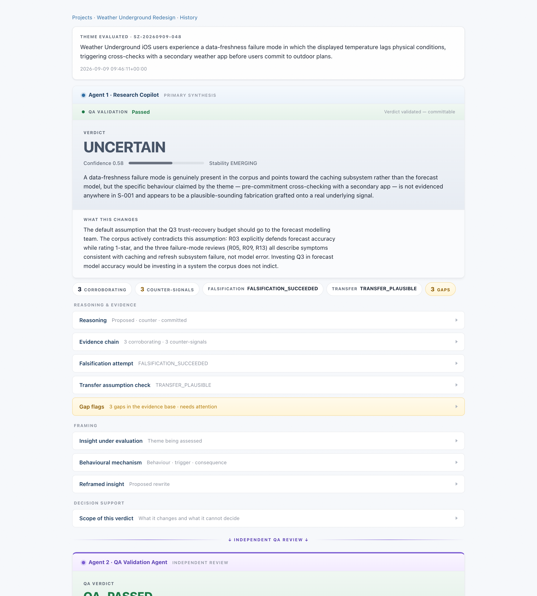
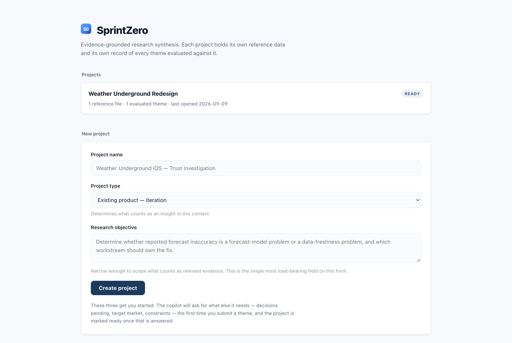
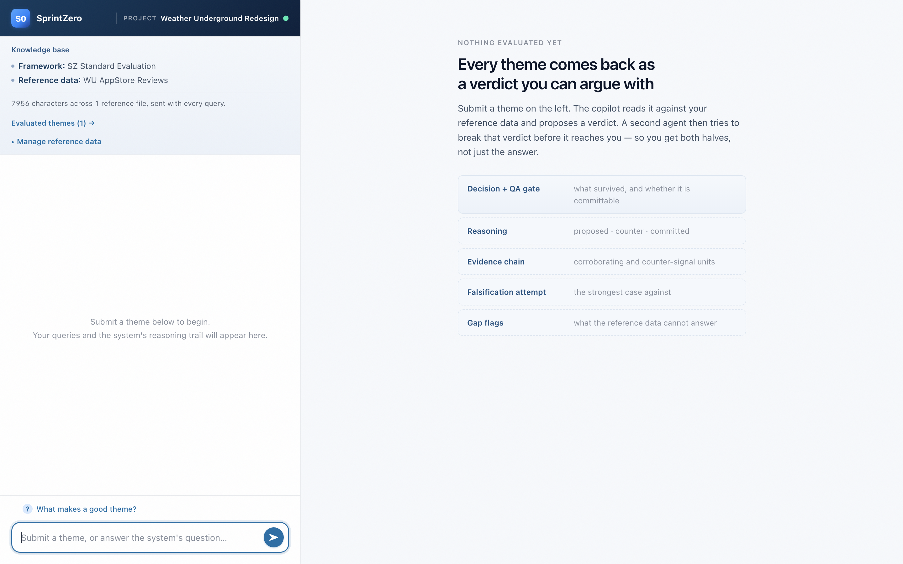

<div align="center">


# SprintZero

**An adversarial QA layer for AI-generated research synthesis.**

Two agents, not one. The first synthesises a verdict from your evidence.
The second tries to find the error it assumes is there — and can block the verdict.

[](../../actions/workflows/probes.yml)
[](LICENSE)
[](https://www.python.org/)

</div>

---

## The problem

Ask an LLM to synthesise user research and it will give you a confident answer. It will
cite evidence. It will assign a confidence score. It will sound like a senior researcher.

It will also, reliably, do this:

> *"This finding may not transfer to the EU market."*

— and then never argue the point. The caveat is decoration. The verdict underneath it is
unchanged. In testing across four frontier models, **all four flagged the transfer
assumption formulaically without once arguing it.** A researcher skimming the output sees
a hedge and reads it as rigour.

That is the failure this project exists to catch. Not hallucination — *unearned
confidence*, which is harder to see and easier to act on.

## The approach

SprintZero runs every synthesis past a second agent whose standing assumption is that the
first one made a mistake.

```
      your reference data
              │
              ▼
   ┌──────────────────────┐
   │  Agent 1 — Copilot   │   synthesises a verdict:
   │  claude-opus-4-7     │   classification, confidence, evidence chain,
   └──────────┬───────────┘   falsification attempt, transfer check
              │
              │  the full XML document
              ▼
   ┌──────────────────────┐
   │  Agent 2 — QA Agent  │   runs seven adversarial checks and stamps
   │  claude-opus-4-7     │   the document. It cannot rewrite the verdict —
   └──────────┬───────────┘   only block it.
              │
              ▼
   verdict + QA gate, in one document
```

Agent 2 returns **only** its `<qa_review>` element; the server merges it. That is a
structural guarantee, not a prompt instruction: Agent 2 is architecturally incapable of
rewriting Agent 1's conclusion. It stamps, it does not re-synthesise.

When the gate fails, the verdict is **visibly invalidated** — struck through, with the
specific action required to unblock it shown directly beneath. A blocked verdict never
renders as if it were valid.

## What makes this more than a wrapper

**Weak evidence is not a failure.** Early user research on this tool surfaced a real
design defect: the UI coloured a `WEAK` verdict in the same red as a failed QA check. But
surfacing weak evidence is the QA layer *succeeding*. The interface was teaching users to
distrust its most valuable output.

The fix was to split one colour vocabulary into two independent axes:

| Axis | Meaning | Rendering |
|---|---|---|
| **Evidence strength** | `STRONG` / `UNCERTAIN` / `WEAK` — a measurement | Neutral ramp. Varies by *depth of ink*, never hue. |
| **QA status** | `QA_PASSED` / `QA_FAILED` — a gate decision | The only axis permitted semantic colour. |

A probe enforces the separation and fails the build if red or green ever reappears on the
strength axis. That rule is written into `:root` where the next person will read it.

**Citations have to resolve.** The schema requires every evidence unit to carry an id, and
the reasoning cites those ids. Pasted text has no ids — so an LLM will invent them, and
the citations will look correct while referencing nothing. Reference data is therefore
annotated at ingest with stable, citable unit ids, and every file carries a
data-limitations preamble telling the agent the segmentation was mechanical.

**Every boundary has a probe that fails loudly.** Eight of them, all deterministic and
free to run — the model is stubbed. They exist because most failures here are silent: a
verdict that renders as valid when it was blocked, evidence that never reaches the prompt,
one project's data appearing in another's synthesis.

## What it looks like

A completed verdict. QA status sits **above** the verdict, not below it; the
`UNCERTAIN` classification renders on the neutral strength ramp while the green belongs
solely to the gate.



Note what the copilot actually caught here. The submitted theme claimed users cross-check
a second app before committing to outdoor plans — and the verdict says that behaviour *"is
not evidenced anywhere in S-001 and appears to be a plausible-sounding fabrication grafted
onto a real underlying signal."* That is the product working: a real failure mode, a
fabricated behavioural claim on top of it, and the two told apart.

<table>
<tr>
<td width="50%"></td>
<td width="50%"></td>
</tr>
<tr>
<td><b>Landing</b> — projects, each with its own reference data and verdict history.</td>
<td><b>Workspace</b> — reference data on the left, what you will get back on the right.</td>
</tr>
</table>

## Quickstart

Requires Python 3.11+ and an [Anthropic API key](https://console.anthropic.com/).

```bash
git clone https://github.com/wedoux/sprintzero.git
cd sprintzero
python3 -m venv venv
./venv/bin/pip install -r requirements.txt

cp .env.example .env        # then add your key
./venv/bin/python app.py    # http://127.0.0.1:5001
```

Run the test suite — no API key needed, nothing is charged:

```bash
for p in _probe_*.py; do case "$p" in
  _probe_streaming.py|_probe_qa_latency.py|_probe_agent1_models.py|_probe_phase*) continue;;
esac; ./venv/bin/python "$p" || break; done
```

<details>
<summary><b>Build the macOS app</b></summary>

```bash
./venv/bin/pip install -r requirements-build.txt
./venv/bin/pyinstaller --noconfirm SprintZero.spec
./venv/bin/python _probe_packaging.py     # asserts completeness AND that it serves
open dist/SprintZero.app
```

pywebview over the local Flask server — it uses the OS's own WKWebView, so the bundle
ships no second runtime. The app is unsigned, so first launch needs right-click → Open.
**No credentials are bundled**: the key is read from the environment, then the macOS
Keychain, then a one-time prompt. A probe walks the built bundle asserting no key
literal, no `.env`, and no trace file made it in.

</details>

## Using it

1. **Create a project** — name, type, and research objective. Three fields.
2. **Answer the copilot.** The remaining context (pending decisions, target market,
   constraints) is collected conversationally on your first query, not by a long form.
3. **Add reference data** — paste text or upload `.txt`/`.md`. Each file is registered,
   assigned an id, and split into citable evidence units.
4. **Submit a theme.** A claim you believe the evidence supports.
5. **Read the gate before the verdict.** If QA blocked it, the required action is the
   thing that matters.

## Measured, not assumed

Performance work here was instrumented before it was optimised, and two plausible
optimisations were **rejected on evidence**:

| Change | Result |
|---|---|
| Stream both agents | First QA check at **~8s** instead of 47s of blank screen |
| Render verdict at `</verdict>` | Verdict on screen at **~17s** instead of ~82s |
| Bump to a newer model | **Rejected** — 2.4–3.2× *slower*, output truncated at the cap |
| Fast mode | **Rejected** — rate-limited on the test account |
| Trim the 17k-token schema | **Rejected** — measurement showed it would save 1–3s |

Two of my own hypotheses were wrong: the prompt cache was working all along, and the
client's progress animation was never the bottleneck. Both are recorded in
[docs/DECISIONS.md](docs/DECISIONS.md) so they don't get re-litigated.

## Documentation

| | |
|---|---|
| [ARCHITECTURE.md](docs/ARCHITECTURE.md) | Pipeline, storage model, output schema, the probe system |
| [DECISIONS.md](docs/DECISIONS.md) | Decisions and their evidence, including the rejected ones |
| [CONTRIBUTING.md](CONTRIBUTING.md) | How to contribute, and the one rule that matters |
| [docs/background/](docs/background/) | Original coursework research: RAG registry, capability map, prompt design |

## Status and honest limitations

This is a **working prototype**, not production software. Specifically:

- **No retrieval.** Every reference file is sent in full with every query. Fine for a
  case-study corpus; it will not scale to a large evidence base.
- **Evidence unit segmentation is crude** — blank-line splits, numbered in order. It makes
  citations resolve; it is not a curated annotation. The protocol that would make it
  rigorous (`A-002`) is specified but unwritten.
- **Single-user.** Flat JSON, no auth, no locking, Flask's development server.
- **A theme takes ~2 minutes** end to end. Streaming makes it *feel* far shorter; it does
  not make it shorter.
- **The model occasionally emits malformed XML** (roughly 1 run in 6). Both agents retry
  once and keep the failed output for diagnosis.

## About

Built by **Nikos Antonogiannis** as the capstone for a **UX for AI Certificate** course
— my first agentic AI project.

The interesting part wasn't wiring up two API calls. It was discovering that the hard
problem in AI-assisted research isn't getting an answer, it's knowing whether to trust
one — and that a second agent with the authority to *block* is a more honest answer to
that than a longer prompt asking the first agent to be careful.

**Data provenance:** the bundled case-study corpus contains short excerpts of public
Weather Underground iOS App Store reviews, used for research-methods demonstration. No
reviewer names, handles, or identifiers are included. See
[corpora/corpus/weather_underground.md](corpora/corpus/weather_underground.md) for the
documented limitations of that dataset.

## License

[MIT](LICENSE) © Nikos Antonogiannis
